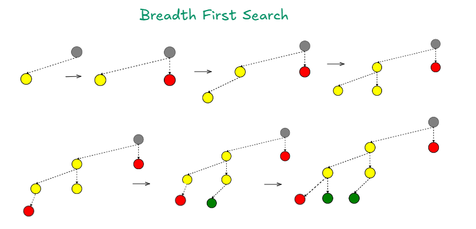
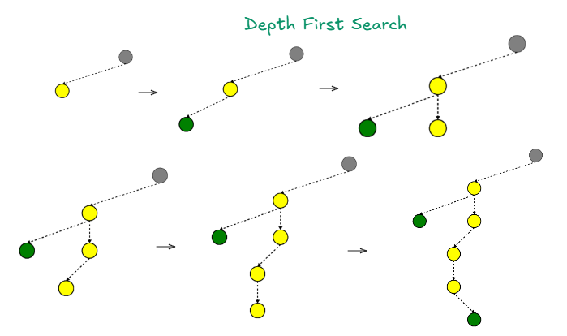

### Inference Time Compute For Reasoning

### Introduction

Large Language Models (LLMs) represent a significant milestone in artificial intelligence. While LLMs excel in a wide variety of tasks, their advanced reasoning capabilities remain limited. Achieving enhanced reasoning typically involves high computation cost and resource-intensive methods such as reinforcement learning with human feedback. However, an optimal solution exists: through limited fine-tuning or already existing LLM's, we can harness inference time compute to achieve substantial reasoning capabilities. This project explores the implementation, effectiveness, and challenges of using inference time compute to enhance reasoning abilities

### Why inference time compute for reasoning?

Reasoning in Large Language Models (LLMs) is commonly achieved through methods such as Reinforcement Learning with Human Feedback (RLHF) and Reinforcement Learning with Verifiable Rewards (RLVF).

RLHF: This method enables LLMs to reason effectively across a wide range of tasks, from subjective to verifiable questions. However, it involves a complex, multi-step process that relies heavily on human preference data and the training of an additional reward model. While RLHF yields strong reasoning capabilities, it is highly computationally intensive and presents challenges such as reward hacking and training instability.

RLVF: Compared to RLHF, RLVF is less complex and more computationally efficient. It is designed for tasks with verifiable answers, such as mathematics and programming, and does not require a reward model or human feedback. This simplifies the training process. However, its applicability is limited to objective, binary-answer domains and is not suitable for open-ended or subjective tasks. Despite its reduced complexity, RLVF still demands considerable computational resources.

Given the complexity, resource demands, and computational intensity of both RLHF and RLVF, there is a clear need for an optimal alternative. Inference-time compute presents a promising solution, enabling LLMs to exhibit considerable reasoning abilities without the need for extensive and expensive traditional training methods.

### Architecture Details Of Inference Time Compute

> **A genuine problem-solving process involves the repeated use of available information to initiate exploration, which discloses, in turn, more information until a way to attain the solution is finally discovered.—— Newell et al.**
> 

### Architecture Details Of Inference Time Compute

The core idea behind inference-time compute is to leverage the LLM’s general understanding of the world and its ability to perform a wide range of generalized tasks. Using this knowledge, the LLM explores the solution space of a given problem by sampling multiple potential intermediate steps from the current partial solution. Each of these steps is evaluated to determine whether it leads to progress, no progress, or a complete solution. This iterative process continues until a valid solution is reached, allowing the LLM to reason through problems in a manner similar to human problem-solving—by trying different combinations, validating them, and choosing the most promising path. This technique exploits the LLM’s latent knowledge to intelligently navigate the problem space.

To enable this behavior, the LLM is set to a slightly higher temperature and prompted to "think step by step" in detail. For each problem, the model is asked to generate the next possible intermediate step, and then multiple (n) possible next steps are sampled in parallel. Each of these sampled steps is evaluated by an LLM-based evaluator to determine its effectiveness. Based on the evaluation, the process proceeds as follows:

* **Progress**: If a step leads to meaningful progress, the LLM is prompted again to generate the next step, given the updated partial solution. This continues iteratively.

* **No Progress**: If a step does not lead to progress, the current path is abandoned, and exploration shifts to other sampled paths at the same level.

* **Solution**: If a step results in a complete solution, that path is recorded, and the system may continue exploring other partial solutions to find a potentially better or more complete result.

### Searching the Solution Space

When exploring the solution space, there are various strategies the LLM can use. Two fundamental approaches are **Breadth-First Search (BFS)** and **Depth-First Search (DFS)**:

* **Breadth-First Search (BFS)**: This strategy explores the solution space level by level. It begins at the root (initial state) and expands all possible directions at the current level before moving deeper. BFS favors wide exploration, ensuring that all possibilities at each stage are considered.

* **Depth-First Search (DFS)**: In contrast, DFS explores one branch of the solution space as deeply as possible before backtracking. It prioritizes depth, focusing on refining a specific direction to completion or until it reaches a dead-end.

Each method has its own advantages and trade-offs. The choice between BFS and DFS depends on the nature of the problem and the desired balance between **exploration** (breadth) and **exploitation** (depth). In inference-time compute, choosing the right strategy helps maximize reasoning efficiency while minimizing unnecessary computation.

### Advantages of Inference-Time Compute

* **Training-Free Reasoning**: Inference-time compute provides a way to achieve reasoning capabilities without requiring expensive and resource-intensive fine-tuning techniques such as RLHF or RLVF.

* **Leverages Existing Knowledge**: It intelligently exploits the LLM’s pre-trained world knowledge by guiding it to reason step by step, enabling it to explore and solve complex problems without additional training.

* **Flexible and Scalable**: This approach is task-agnostic and can be applied across domains such as mathematics, coding, logical reasoning, and open-ended questions, as long as the reasoning process can be broken into intermediate steps.

* **Human-Like Problem Solving**: It mimics human reasoning by trying various hypotheses, evaluating outcomes, and iterating until a solution is reached, making the process more interpretable and transparent.

### Limitations

* **High Inference Cost**: Although it avoids training costs, inference-time compute can still be computationally expensive during deployment due to the need for multiple forward passes and evaluations for each problem step.

* **Latency**: The iterative and sampling-based approach increases response time, making it less suitable for real-time applications or low-latency environments.

* **Search Inefficiency**: Without a well-optimized search strategy, the method may explore irrelevant or redundant paths, leading to inefficient reasoning or failure to find a solution.

* **Evaluator Reliability**: The quality of reasoning depends heavily on the accuracy of the step evaluator. If the evaluator misjudges a step's usefulness, it may lead the LLM away from the correct path.

### Conclusion

Inference-time compute offers a promising and efficient alternative to traditional fine-tuning methods for enhancing the reasoning capabilities of large language models. By leveraging the LLM’s existing knowledge and guiding it to explore the solution space step-by-step, this approach provides a practical pathway to advanced reasoning without the high costs of RLHF or RLVF. However, it comes with its own challenges, particularly in terms of inference cost, latency, and evaluator reliability. With further research and optimization, inference-time compute has the potential to become a core technique for enabling reasoning in future LLM-based systems.

